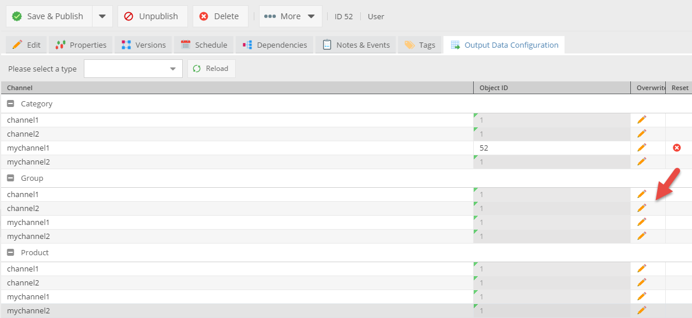
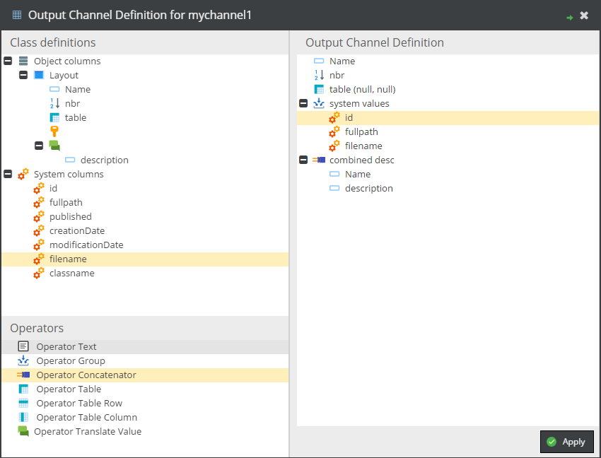

# OutputDataConfigToolkit

This toolkit provides an user interface to create output formats for objects based on different output channels.
So it is possible to define, which attributes of an objects should be printed in a certain output channel.
An output data configuration consists of
- values = object attributes
- operators = can combine, modify, calculate, ... values

## Configuration

After installing the plugin, a config file is located at `/website/config/outputdataconfig/config.php`. In this config file available output channels can be configured as follows:

```php
<?php
    return [
        "channels" => [
            "channel1",
            "channel2",
            "mychannel1",
            "mychannel2"
        ]
    ];
```

## Defining output data configuration for different output channels

Output data configurations can be configured in an additional tab in the object editor.
There for each object class and output channel an output output data configuration can be defined.




The output data configurations can be inherited along the objects tree. The column Object ID shows from with object the output data configuration is inherited from.
By clicking overwrite, the editor opens and a new output data configuration can be configured.




## Working with output channels in code

The plugin provides a service class, with converts an pimcore object to an output data structure based on its ouput data configuration.

```php
<?php

    // returns the output data structure for the given product and the output channel productdetail_specification
    $specificationOutputChannel =  Elements\OutputDataConfigToolkit\Service::getOutputDataConfig($product, "productdetail_specification");

    //printing output channel in view script with view-helper
    foreach($specificationOutputChannel as $property) {
        $this->productListSpecification($property, $this->product);
    }
```

A sample view helper see readme/ProductListSpecification.php

### used by projects for example
- E-Commerce-Demo (http://ecommercedemo.pimcore.org)

## Adding new operators
Create a pimcore plugin and add following files:

### php implementation of operator
- must be in namespace `Elements\OutputDataConfigToolkit\ConfigElement\Operator`
- must implement `AbstractOperator`


```php
<?php
namespace Elements\OutputDataConfigToolkit\ConfigElement\Operator;

class RemoveZero extends AbstractOperator {


    public function __construct($config, $context = null) {
        parent::__construct($config, $context);
    }

    public function getLabeledValue($object) {
        $childs = $this->getChilds();
        if($childs[0]) {

            $value = $childs[0]->getLabeledValue($object);
            $value->value = $value->value == 0 ? null : $value->value;

            return $value;
        }
        return null;
    }

}
```

### java script implementation of operator
- must be in namespace `pimcore.plugin.outputDataConfigToolkit.outputDataConfigElements.operator`
- must extend `pimcore.plugin.outputDataConfigToolkit.outputDataConfigElements.Abstract`

```javascript
pimcore.registerNS("pimcore.plugin.outputDataConfigToolkit.outputDataConfigElements.operator.RemoveZero");

pimcore.plugin.outputDataConfigToolkit.outputDataConfigElements.operator.RemoveZero = Class.create(pimcore.plugin.outputDataConfigToolkit.outputDataConfigElements.Abstract, {
    type: "operator",
    class: "RemoveZero",
    iconCls: "pimcore_icon_operator_remove_zero",
    defaultText: "operator_remove_zero",


    getConfigTreeNode: function(configAttributes) {
        if(configAttributes) {
            var node = {
                draggable: true,
                iconCls: this.iconCls,
                text: t(this.defaultText),
                configAttributes: configAttributes,
                isTarget: true,
                maxChildCount: 1,
                expanded: true,
                leaf: false,
                expandable: false
            };
        } else {

            //For building up operator list
            var configAttributes = { type: this.type, class: this.class};

            var node = {
                draggable: true,
                iconCls: this.iconCls,
                text: t(this.defaultText),
                configAttributes: configAttributes,
                isTarget: true,
                maxChildCount: 1,
                leaf: true
            };
        }
        return node;
    },


    getCopyNode: function(source) {
        var copy = new Ext.tree.TreeNode({
            iconCls: this.iconCls,
            text: t(this.defaultText),
            isTarget: true,
            leaf: false,
            maxChildCount: 1,
            expanded: true,
            configAttributes: {
                label: null,
                type: this.type,
                class: this.class
            }
        });
        return copy;
    },


    getConfigDialog: function(node) {
    },

    commitData: function() {
    }
});
```

## Migration from Pimcore 4
- Change table name from `plugin_outputdataconfigtoolkit_outputdefinition`to 
`bundle_outputdataconfigtoolkit_outputdefinition`. 
- Change namespace from `Elements\OutputDataConfigToolkit` to `OutputDataConfigToolkitBundle`.
- Removed key value support.
- Changed permission key to `bundle_outputDataConfigToolkit`