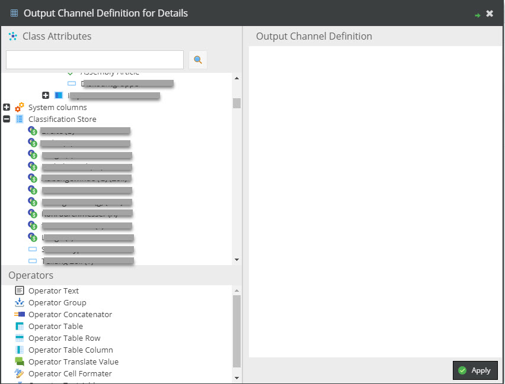
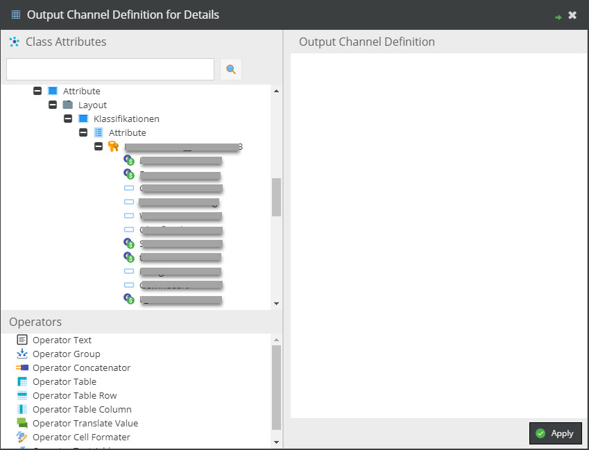

### Classificationstore
Via the config option `output_data_config_toolkit.classification_store.display_mode` it is possible to choose 
different display modes for classification store keys in the output definition config window:
1. `all`: all classificationstore keys are displayed at the bottom of the config tree
2. `object`: only keys which are in any assigned group of the current object
3. `relevant`: `object` mode is used if any group is assigned, else `all` keys are shown
4. `none`: No classificationstore keys are displayed

##### DisplayMode `all` or `relevant` and type is folder or the object has no assigned group


##### DisplayMode `object` or `relevant` and object has any assigned group


#### Get classificationstore key value, assign classificationstore name and classificationstore group.
for eq. 
```php
    $outputDataConfig = OutputDataConfigToolkitBundle\Service::getOutputDataConfig($object, 'Output config channel');
    $outputDataConfig[0]->classificationstore = 'Attributes';     ### classificationstore field name in object 
    $outputDataConfig[0]->classificationstore_group = 'Product';  ### Classificationstore group name
    $outputDataConfig[0]->getLabeledValue($object);
```